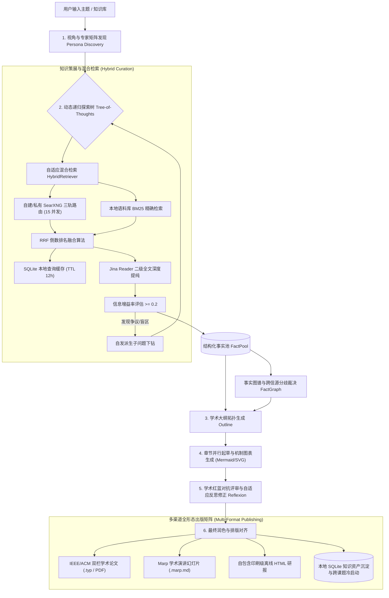

<div align="center">
  
  &nbsp;&nbsp;
  
</div>

<h1 align="center">溯知 · SuZhi（STORM）</h1>

<p align="center">
  <strong>溯流求源，知汇成章</strong><br/>
  <em>Trace the current to its source; knowledge gathers into writing.</em>
</p>

<p align="center">
  
  
  
  
  
  
</p>

<p align="center">
  <b>鹿溪联合创新实验室</b>（LUXI Joint Innovation Lab）出品 · 矩阵：工坊·一法<br/>
  仓库：<a href="https://github.com/itrilogy/LUCY-SUZHI">itrilogy/LUCY-SUZHI</a>
</p>

---

溯知（英文 **SuZhi**，引擎代号 **STORM**）是鹿溪联合创新实验室出品的深度知识策展与学术长文生成系统：多视角检索、事实图谱、递归探索，把散落信源写成可引用的长文，并导出论文、幻灯片与离线研报。

> 自研主路径：`knowledge_storm/async_core/` + `server/` + `frontend/web/` + `cli/`。  
> 上游 Stanford STORM 位于 `knowledge_storm/storm_wiki/` 等目录，MIT 许可，**不是**本产品的运行入口。  
> 软著与使用文档：[`docs/`](./docs/README.md)

---

## 🎯 STORM 引擎能力（自研异步内核）

**STORM (Synthesis of Topic Outlines & Research Material)** 在本仓库中指溯知的技术引擎：生产级、全配置驱动、纯异步轻量化、支持深度递归探索的自动化知识策展与学术长文出版管线。

---

## 🚀 系统架构与核心能力 (System Architecture)

STORM 彻底重构了传统同步阻塞架构，基于 `HTTPX + AsyncIO + SQLite WAL + Pydantic v2` 构建了轻量级、高并发、可恢复的深度研究管线：



---

## ✨ 核心特性矩阵 (Key Highlights)

1. **⚡ 纯异步轻量内核 (Zero Heavy Footprint)**：
   * 彻底剥离 PyTorch / Transformers / DSPy 运行时强依赖，常驻内存从 $>3.5\text{GB}$ 骤降至 **$<80\text{MB}$**，启动速度从 $>15\text{s}$ 缩短至 **$<300\text{ms}$**。
2. **🌲 动态递归探索树 (Deep Tree-of-Thoughts)**：
   * 突破固定轮数静态遍历，根据信息增益率（Information Gain）自发评估知识缺口，针对争议与关键机制进行深度分支下钻。
3. **🔍 多源混合检索与 RRF 融合 (Hybrid Search & RRF)**：
   * 本地语料库（Markdown/PDF/代码）BM25 词频索引与外部网络检索融合，基于 **RRF (Reciprocal Rank Fusion)** 倒数排名算法高精度打分重排。
4. **⚖️ 事实图谱与多信源冲突裁决 (Fact Graph & Discrepancy Matrix)**：
   * 提取实体-关系图谱，自动比对跨信源数据差异并生成"信源分歧对比表格"直接嵌入正文。
5. **📊 多模态图表与数据绘图 (Mermaid & Native SVG)**：
   * 自动解析章节核心机制生成合法的 Mermaid 流程/时序图；原生渲染纯 SVG 矢量柱状对比图。
6. **🎯 学术红蓝对抗评审与反思修正 (Academic Review & Reflexion)**：
   * 6 维度量化评审打分（严谨度、真实性、论述深度等），自动定位无引用孤立断言并触发自适应 Reflexion 局部修补闭环。
7. **📑 多渠道全格式一键出版 (Multi-Format Publishing)**：
   * 一键导出 **IEEE/ACM 双栏学术论文 (.typ/PDF)**、**Marp 演说幻灯片 (.marp.md)**、**自包含印刷级离线 HTML 研报**。
8. **⚙️ 统一强类型配置中心 (ConfigHub)**：
   * 四层优先级继承（CLI > Env > TOML > Presets），预置全生态厂商（DeepSeek、SiliconFlow、OpenAI、Ollama、SearXNG 等），支持异步探测测速（RTT）与模型自发现。
9. **🛡️ SQLite WAL 状态机与 100% 断点续跑 (Resumable Workflow)**：
   * 任务在任意环节物理中断后，通过 `--resume <task_id>` 可 **100% 精确恢复**，零算力与 Token 浪费。

---

## 🛠️ 快速安装 (Installation)

无需 GPU。请使用虚拟环境，系统自带的 `python3` **不会**自动带上 FastAPI。

```bash
git clone https://github.com/itrilogy/LUCY-SUZHI.git
cd LUCY-SUZHI

python3 -m venv .venv
source .venv/bin/activate          # Windows: .venv\Scripts\activate
pip install -r requirements.txt
```

之后一律用该环境中的解释器：

```bash
python -m server.app               # 或 .venv/bin/python -m server.app
```

浏览器打开 **http://127.0.0.1:8000**（默认只绑本机）。完整操作见 [`docs/03-用户使用手册.md`](./docs/03-用户使用手册.md)。软著与设计文档见 [`docs/`](./docs/README.md)。

---

## ⚙️ 模型与引擎配置 (Configuration)

STORM 支持三种配置方式，确立严格的四层继承优先级：

### 方式 1：环境变量 (推荐生产部署)
```bash
export DEEPSEEK_API_KEY="sk-your-deepseek-api-key"
export DEEPSEEK_API_BASE="https://api.deepseek.com"
export SEARXNG_API_URL="https://search.nunch.uk/search"  # 或您的自建 SearXNG 地址
```

### 方式 2：用户配置文件 (`~/.storm/config.toml`)
```toml
[llm]
active = "deepseek"
deepseek.api_key = "sk-your-key"
deepseek.base_url = "https://api.deepseek.com"
deepseek.model = "deepseek-chat"

[search]
active_retriever = "searxng"
searxng.api_url = "https://search.nunch.uk/search"
searxng.engines_academic = "semantic_scholar,arxiv,pubmed,google_scholar"
searxng.engines_chinese = "google,bing,baidu,zhihu"
searxng.engines_general = "google,bing,duckduckgo"
```

### 方式 3：Web 控制台可视化配置（免命令行编辑）
启动 Web 服务后，在界面点击右上角 **"⚙️ 系统与模型配置"**，支持界内切换厂商、点击 **"⚡ 探测并拉取模型"** 测算延迟并一键保存热重载。

---

## 💻 四大核心使用模式 (Usage Modes)

### 模式 1：现代响应式 Web 控制台 (首选推荐)

启动高性能 FastAPI + SSE 流式服务（先激活 `.venv`）：

```bash
source .venv/bin/activate
python -m server.app
```

* 浏览器访问：`http://127.0.0.1:8000`
* **功能亮点**：五段演进轴、正文左侧「研讨现场」角色对谈（主持人 / 视角 / 书记员 / 审稿人）、任务断点续跑与复跑对比、知识库冷启动、一键导出 Typst（有 CLI 则 PDF）/ Marp / 离线研报（无 CDN）。

---

### 模式 2：命令行 CLI 深度研究跑批 (Production CLI)

```bash
# 1. 基础快速研究
python -m cli.async_runner --topic "Vibe Coding in Software Engineering"

# 2. 启用深度递归探索树 (Tree-of-Thoughts)
python -m cli.async_runner \
  --topic "Vibe Coding as a Paradigm for AI-Assisted Software Development" \
  --deep-research \
  --max-depth 2 \
  --perspectives 4

# 3. 挂载本地知识库/语料库进行 RRF 混合检索
python -m cli.async_runner \
  --topic "企业内部微服务治理演进" \
  --local-docs-dir ./raw_sources \
  --deep-research

# 4. 中断恢复与断点续跑 (Resuming Tasks)
python -m cli.async_runner \
  --topic "企业内部微服务治理演进" \
  --resume storm_a1b2c3d4
```

---

### 模式 3：Python SDK 编程式调用 (SDK Integration)

```python
import asyncio
from knowledge_storm.async_core import (
    AsyncLLM,
    AsyncSearXNG,
    AsyncSTORMPipeline,
    WorkflowStateManager,
)

async def main():
    llm = AsyncLLM(model="deepseek-chat", api_key="sk-...", api_base="https://api.deepseek.com")
    retriever = AsyncSearXNG(api_url="https://search.nunch.uk/search")
    
    pipeline = AsyncSTORMPipeline(
        llm=llm,
        retriever=retriever,
        deep_research=True,
        max_depth=2,
        enable_review=True,
        enable_diagrams=True,
    )
    
    article = await pipeline.run(
        topic="Transformer vs Mamba Architecture Tradeoffs",
        progress_callback=lambda stage, data: print(f">> Stage: {stage}"),
    )
    print(f"生成的文章标题: {article.topic}")
    print(f"正文字数: {len(article.content)}")

if __name__ == "__main__":
    asyncio.run(main())
```

---

### 模式 4：Typst 双栏论文与学术幻灯片编译

```bash
# 编译 IEEE/ACM 双栏学术 PDF (需安装 Typst: brew install typst)
typst compile results_async/<task_id>/paper.typ paper.pdf

# 编译 Marp 学术演示文稿 (需安装 Marp CLI)
npx @marp-team/marp-cli results_async/<task_id>/slides.marp.md -o presentation.pptx
```

---

## 📁 产出物结构说明 (Output Artifacts)

每次研究任务执行完毕后，所有产物将结构化保存在 `results_async/<task_id>/` 目录下：

```
results_async/storm_a1b2c3d4/
├── article.md                # 完整正文 Markdown（含精确 [i] 引用与 Mermaid 图表）
├── outline.md                # 结构化多级学术大纲
├── citations.json            # 参考文献元数据（URL、标题、摘录、信源档位）
├── fact_pool.json            # 全量原子事实池
├── seminar.jsonl             # 研讨现场对白（刷新可回放）
├── paper.typ                 # IEEE/ACM 双栏学术论文 Typst 源码
├── paper.pdf                 # 若本机已安装 Typst CLI
├── slides.marp.md            # Marp 演讲幻灯片演示文稿
└── report_standalone.html    # 独立自包含印刷级 HTML 研报（无 CDN）
```

---

## 🧪 自动化测试验证 (Testing Suite)

激活 `.venv` 后运行：

```bash
python tests/test_async_core.py
python tests/test_security_guards.py
python tests/test_seminar_and_export.py
python tests/test_http_surface.py          # 空主题 / 脱敏 / 品牌页 / 探测拦截
python tests/test_server_and_typst.py
python tests/test_config_hub_and_probe.py
python tests/test_advanced_features.py
python tests/test_full_pipeline_e2e.py
# 可选浏览器冒烟：
# pip install playwright && playwright install chromium
# PLAYWRIGHT=1 python tests/test_ui_playwright.py
```

---

## 🎨 品牌标识

| 标识 | 预览 | 说明 | 源文件 |
| :---: | :---: | :--- | :--- |
| **产品方标** |  | 三信源汇流 + 成文章页（鹿溪绿底） | `frontend/web/brand/suzhi-mark.svg` |
| **产品字锁** | [`frontend/web/brand/logo.svg`](frontend/web/brand/logo.svg) | 横版产品字锁 | `frontend/web/brand/logo.svg` |
| **实验室主标** |  | 官方 LUXI LAB | `frontend/web/brand/luxi-lab-main.svg` |

**色板（LUXI CI）**

| Token | 色值 | 用途 |
| :--- | :--- | :--- |
| 鹿溪绿 | `#0D5E42` | 主色 / 图标底板 |
| 源启白 | `#F5F7FA` | 浅色背景 / 反白 |
| 进化蓝 | `#00D2FF` | 溪流 / 数据高亮 |
| 标题金 | `#F1C40F` | 落点 / 显著信号 |

---

## 📑 素材库与深度技术文档索引 (Knowledge Assets)

详尽的技术报告与架构演进指南已持久化归档于 `素材/` 目录中：

| 文档名称 | 核心主题 |
| :--- | :--- |
| **[STORM_完整功能与使用操作指南.md](素材/STORM_完整功能与使用操作指南.md)** | 全模式详细操作与故障排查 (Troubleshooting) |
| **[STORM_代码实际功能完整性与可用性全量审计报告.md](素材/STORM_代码实际功能完整性与可用性全量审计报告.md)** | 10 大子系统功能判定与 6 大测试套件回归记录 |
| **[STORM_多模态图表_学术评审与多格式出版落地实录.md](素材/STORM_多模态图表_学术评审与多格式出版落地实录.md)** | 图表合成、6 维学术评审与多格式出版落地实录 |
| **[STORM_配置中心与全生态Provider体系落地实录.md](素材/STORM_配置中心与全生态Provider体系落地实录.md)** | 四层配置继承引擎与 SQLite 检索缓存落地实录 |
| **[STORM_自建SearXNG服务端与客户端全链路性能调优指南.md](素材/STORM_自建SearXNG服务端与客户端全链路性能调优指南.md)** | 自建 SearXNG 解除 Limiter 与长连接池调优 |
| **[STORM_Phase1_现代异步架构与基建落地实录.md](素材/STORM_Phase1_现代异步架构与基建落地实录.md)** | Phase 1 纯异步轻量内核与状态机设计 |
| **[STORM_Phase2_深度研究能力落地实录.md](素材/STORM_Phase2_深度研究能力落地实录.md)** | Phase 2 动态递归探索树与事实图谱裁决 |
| **[STORM_Phase3_现代流式交互与学术排版落地实录.md](素材/STORM_Phase3_现代流式交互与学术排版落地实录.md)** | Phase 3 FastAPI+SSE 服务端与 Web 控制台 |
| **[素材/README.md](素材/README.md)** | 素材库归档总索引 |

---

## 🙏 原项目致谢与学术引用 (Acknowledgements & Citations)

本项目基于 **Stanford University Open Virtual Assistant Lab (OVAL)** 的原始科研探索 **STORM** 进行现代化工程重构与架构跃迁。谨向 Stanford OVAL 团队及相关论文作者致以诚挚敬意。

若在学术研究或商业项目中使用了本代码库或其设计思路，请引用原始 Stanford 论文：

```bibtex
@inproceedings{shao-etal-2024-assisting,
    title = "Assisting in Writing {W}ikipedia-like Articles From Scratch with Large Language Models",
    author = "Shao, Yijia  and
      Jiang, Yucheng  and
      Kanell, Theodore  and
      Xu, Peter  and
      Khattab, Omar  and
      Lam, Monica",
    booktitle = "Proceedings of the 2024 Conference of the North American Chapter of the Association for Computational Linguistics: Human Language Technologies (Volume 1: Long Papers)",
    month = jun,
    year = "2024",
    address = "Mexico City, Mexico",
    publisher = "Association for Computational Linguistics",
    url = "https://aclanthology.org/2024.naacl-long.347/",
    doi = "10.18653/v1/2024.naacl-long.347",
    pages = "6252--6278",
}

@inproceedings{jiang-etal-2024-unknown,
    title = "Into the Unknown Unknowns: Engaged Human Learning through Participation in Language Model Agent Conversations",
    author = "Jiang, Yucheng  and
      Shao, Yijia  and
      Ma, Dekun  and
      Semnani, Sina  and
      Lam, Monica",
    booktitle = "Proceedings of the 2024 Conference on Empirical Methods in Natural Language Processing",
    month = nov,
    year = "2024",
    address = "Miami, Florida, USA",
    publisher = "Association for Computational Linguistics",
    url = "https://aclanthology.org/2024.emnlp-main.554/",
    doi = "10.18653/v1/2024.emnlp-main.554",
    pages = "9917--9955",
}
```

---

## 📄 开源许可证 (License)

本项目采用 **Apache 2.0 开源许可证**。详见 [LICENSE](LICENSE) 文件。

---

<div align="center">
  
  <p><strong>溯知 · SuZhi</strong> · 溯流求源，知汇成章</p>
  <p>© 鹿溪联合创新实验室 · LUXI Joint Innovation Lab</p>
  <p><em>林深见鹿，源启清溪 · Deep Insights, Evolutionary Origin.</em></p>
</div>
