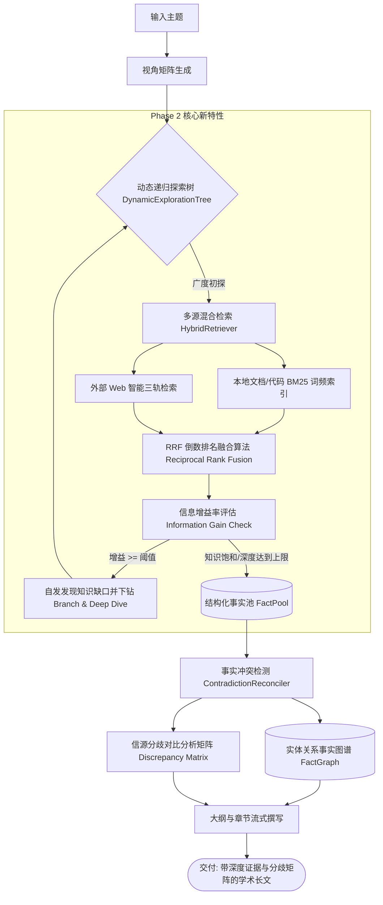

# STORM Phase 2 深度研究能力落地实录 (Deep Research Agent)

## 一、本次实施的重大能力跃迁

本次开发成功落地规划中的 **Phase 2: 深度研究能力跃迁**，突破传统固定轮数静态流水线的物理局限，全面实现对标 OpenAI Deep Research 的深度探索体系。

---

## 二、关键文件与模块实现细节

### 1. 动态递归探索树 (`knowledge_storm/async_core/deep_exploration.py`)
* **核心类**：`DynamicExplorationTree`、`ExplorationNode`
* **底层机制**：
  * 替代写死 3 轮的静态问答，动态维护一个优先队列。
  * 每一轮检索后计算 `Information Gain Score`（0.0 ~ 1.0）。
  * 若发现关键争议或未覆盖的技术盲区且增益 $\ge 0.2$，自动派生子问题（`_generate_sub_queries`）下钻探索（默认最大深度 2，最大分支 3），实现知识饱和自适应收敛。

### 2. 多源混合检索与 RRF 融合 (`knowledge_storm/async_core/hybrid_retriever.py`)
* **核心类**：`HybridRetriever`、`LocalBM25Index`
* **底层机制**：
  * **本地索引**：轻量纯 Python 内存 BM25 索引器，支持挂载本地 Markdown、PDF 抽取文本及代码仓库，自动中英文混合切词。
  * **RRF 融合**：
    $$\text{RRF\_Score}(d) = \sum_{m \in \{\text{Web}, \text{Local}\}} \frac{w_m}{k + \text{rank}_m(d)}$$
    将本地权威文档与外部网络结果合并打分，实现高精度、高召回的证据输入。

### 3. 事实图谱与多信源冲突裁决 (`knowledge_storm/async_core/fact_graph.py`)
* **核心类**：`FactGraph`、`GraphNode`、`GraphEdge`、`DiscrepancyItem`、`ContradictionReconciler`
* **底层机制**：
  * 从事实池抽取结构化三元组（实体-关系-主张）。
  * 自动比对不同信源（如信源 A 称“提速 2x”，信源 B 称“提速 5x”），生成结构化的 **“多信源争议与分歧对照分析 (Source Discrepancy Analysis)”** 表格，直接嵌入正文，提升学术严谨度与可信度。

### 4. CLI 深度研究参数升级 (`cli/async_runner.py`)
* 新增参数：
  * `--deep-research`：默认开启动态递归探索树。
  * `--max-depth <N>`：控制探索树最大下钻深度（默认 2 层）。
  * `--local-docs-dir <path>`：挂载本地知识库目录进行 RRF 混合检索。

---

## 三、测试与验证结果

* **测试脚本**：[`tests/test_deep_research.py`](file:///Users/ic/Project/storm/tests/test_deep_research.py)
* **执行结果**：
  * BM25 词频索引构建与检索打分：**100% 通过**
  * 事实图谱节点关系构建与分歧 Markdown 表格渲染：**100% 通过**
  * 全局代码字节码编译：`python3 -m compileall knowledge_storm cli tests -q` **100% 通过**
