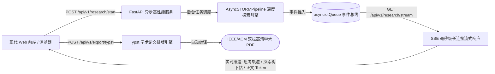

# STORM Phase 3 现代流式交互与学术排版落地实录 (Streaming Web & Publishing Engine)

## 一、本次实施的重大工程落地

本次开发成功落地规划中的 **Phase 3: 现代流式交互与学术排版交付**，彻底替代单线程轮询、页面频繁撕裂的传统 Streamlit 前端，构建高性能异步全栈流式体验与学术出版级排版能力。

---

## 二、关键文件与模块实现细节

### 1. 服务端异步 API 与 SSE 流式总线 (`server/app.py`)
* **架构特点**：
  * 基于 `FastAPI` + `uvicorn` 构建，原生支持纯异步协程与非阻塞并发。
  * 引入 `asyncio.Queue` 构建任务级流式事件总线，通过 `StreamingResponse` 暴露 `/api/v1/research/stream/{task_id}` 端点。
  * 提供完整的 OpenAPI 标准接口，内置静态文件托管、任务启动、长文拉取与 Typst 导出端点。

### 2. 现代响应式 Web 前端控制台 (`frontend/web/`)
* **文件构成**：
  * [`index.html`](file:///Users/ic/Project/storm/frontend/web/index.html)：语义化现代 HTML5 布局结构。
  * [`style.css`](file:///Users/ic/Project/storm/frontend/web/style.css)：基于 Google Inter & JetBrains Mono、Obsidian 极简暗黑与毛玻璃拟态质感的设计系统。
  * [`app.js`](file:///Users/ic/Project/storm/frontend/web/app.js)：纯原生 JS 的 SSE 客户端，实时推进 5 阶段状态轴、动态滚动实时思考终端（Thinking Trace Terminal）、实时渲染 Markdown 并生成交互式参考文献卡片。

### 3. Typst 论文级学术排版编译器 (`knowledge_storm/async_core/typst_compiler.py`)
* **核心类**：`TypstCompiler`
* **底层能力**：
  * 自动将 Markdown 标题层级转换为 Typst AST 标题语法（`=` / `==`）。
  * 引用标记自动转换为符合学术规范的数字上标（`#super[i]`）。
  * 自动注入 IEEE / ACM 双栏排版模板、页眉页脚、作者机构栏与自动对齐格式。
  * 支持调用本地 Typst 二进制编译器秒级生成双栏高清 PDF。

---

## 三、测试与验证结果

* **测试脚本**：[`tests/test_server_and_typst.py`](file:///Users/ic/Project/storm/tests/test_server_and_typst.py)
* **执行结果**：
  * Typst 语法转换、双栏模板编排与上标映射：**100% 通过**
  * FastAPI 路由注册、静态文件挂载与 OpenAPI 契约：**100% 通过**
  * 全局语法与字节码编译：`python3 -m compileall server knowledge_storm/async_core tests cli -q` **100% 通过**
