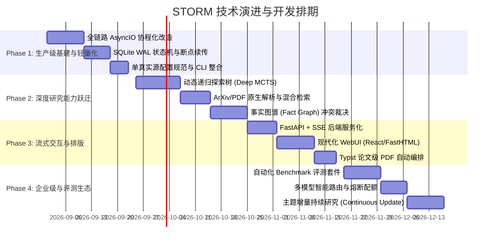

# STORM 产品基本功能规划与后续开发演进路线图

## 一、系统物理定位与核心目标 (System Positioning)

STORM 的核心物理使命是解决**长文本知识密集型内容生成的两大底层限制**：
1. **上下文窗口与信息密度矛盾**：单次 Prompt 无法吞吐全网检索的海量离散事实，必须通过“模块化分解与阶段性提纯”实现从非结构化互联网信息到高密度结构化论文的转换。
2. **生成幻觉与引用失真**：生成模型必须有严格的物理证据锚定（Grounded Attribution），每个事实陈述必须绑定真实的溯源引用链（Citation Anchor）。

---

## 二、STORM 基本功能规划矩阵 (Baseline Functional Architecture)

系统划分为五大不可割裂的核心功能管道（Pipeline Modules）：

```mermaid
flowchart LR
    subgraph Sub_S1 ["1. 意图与边界定义"]
        A["输入主题/引导材料"] --> B["意图识别与研究边界收敛"]
        B --> C["动态视角/角色矩阵生成"]
    end

    subgraph Sub_S2 ["2. 知识策展与事实沉淀"]
        C --> D["多轨网络/本地检索"]
        D --> E["模拟专家深度问答"]
        E --> F["FactPool 事实池提取与去重"]
    end

    subgraph Sub_S3 ["3. 大纲与拓扑编排"]
        F --> G["全局大纲生成"]
        G --> H["章节依赖 DAG 拆解"]
    end

    subgraph Sub_S4 ["4. 正文流式合成"]
        H --> I["章节并行起草"]
        I --> J["反向引用精准绑定"]
    end

    subgraph Sub_S5 ["5. 审计润色与交付"]
        J --> K["合规与事实矛盾审计"]
        K --> L["多格式输出: MD / PDF / HTML"]
    end
```

### 核心功能模块明细

| 功能模块 | 核心职责 | 输入产物 | 输出产物 | 质量基准 |
| :--- | :--- | :--- | :--- | :--- |
| **1. 意图与边界收敛** | 约束研究范围，自动识别中英文语种，生成 3~5 个互补视角的 Persona 矩阵。 | 用户主题字符串 / 种子材料 | `List[Persona]` 视角定义 | 视角互斥且覆盖全面（技术/商业/安全/社会影响）。 |
| **2. 知识策展 (Curation)** | 多轨路由检索（学术/通用/中文），多轮对话模拟，提取原子事实。 | 主题 + Persona | `FactPool`（事实三元组与摘要片段） | 过滤垃圾爬虫页面，去重率 $\ge 80\%$。 |
| **3. 大纲编排 (Outline)** | 结合 FactPool 规划多级大纲树（H1/H2/H3），拆解章节写作任务。 | FactPool + 主题 | `StormArticle` 大纲结构树 | 逻辑演进清晰，无章节语义重叠。 |
| **4. 正文合成 (Generation)** | 章节级并行合成，基于召回片段严格插入 `[i]` 引用标号，拼接完整初稿。 | 大纲 + 检索片段 + 事实池 | `storm_gen_article.txt` | 正文段落引用密度 $\ge 2$ 处/段，无空引用。 |
| **5. 后生成审计 (Audit)** | 检测跨章节事实矛盾、重复啰嗦、虚构断言并进行结构化标红。 | 初稿 + 引用字典 | 结构化 `AuditReport` + 润色定稿 | 事实与引用源一致性达 $100\%$。 |

---

## 三、后续分阶段开发规划 (Phased Development Roadmap)

---

### Phase 1：生产级基建与轻量化（目标：稳定、低耗、可恢复）

* **里程碑 1.1：全异步协程与零 PyTorch 化**
  * 彻底移除 `torch`、`transformers`、`dspy` 运行时代谢，改用纯 `httpx` + `asyncio`。
  * 容器镜像体积压缩至 **< 100MB**，单机并发任务承载量提升 **10 倍**。
* **里程碑 1.2：DAG 状态机与断点续跑 (Resumable Workflow)**
  * 引入 `aiosqlite` 记录节点执行状态。若进程在“第 4 轮对话”或“第 3 章节起草”时因网络超时或手动中断，重启后自动加载 Checkpoint 继续执行，**零算力浪费**。
* **里程碑 1.3：配置体系统一化 (Single Source of Truth)**
  * 统一 `~/.storm/config.toml` 作为唯一真实配置源，支持环境变量最高优先级覆盖。

---

### Phase 2：深度研究能力跃迁（目标：对标 OpenAI Deep Research）

* **里程碑 2.1：动态递归探索树 (MCTS / Tree-of-Thoughts)**
  * 废弃固定轮数的静态 Persona 轮询，改为依据**信息增益率（Information Gain）**动态自发提问。
  * 遇到关键争议点自动分支下钻（Depth-first Search），直至知识饱和。
* **里程碑 2.2：多模态与多源证据融合**
  * 引入 PDF 原生解析（`pymupdf`），直接抓取并解析 ArXiv/PubMed 学术论文正文与数据表。
  * 支持挂载本地知识库与代码仓库，实现 **BM25 + Dense Vector + RRF (Reciprocal Rank Fusion)** 混合检索。
* **里程碑 2.3：事实图谱 (Fact Graph) 与分歧自动裁决**
  * 将传统单维文本日志升级为实体关系三元组事实图谱。
  * 遇到不同信源数据冲突时，在报告中自动生成“分歧对照分析矩阵”，杜绝隐形幻觉。

---

### Phase 3：流式交互与现代排版（目标：极致产品体验与专业交付）

* **里程碑 3.1：FastAPI + SSE (Server-Sent Events) 服务端改造**
  * 淘汰脆弱的 Streamlit 阻塞架构，暴露标准 OpenAPI 接口。
  * 支持前端毫秒级接收思考步骤（Thinking Process）、检索轨迹与逐字流式打字。
* **里程碑 3.2：现代化 Web 控制台**
  * 提供响应式现代前端，支持研究知识拓扑图可视化、实时引用溯源悬浮预览、大纲拖拽交互。
* **里程碑 3.3：Typst 学术排版集成**
  * 内置单个 20MB 的 Typst 二进制编译工具，替代 5GB 的 LaTeX。
  * 一键自动渲染为双栏 IEEE/ACM 论文格式、咨询研报格式的高清 PDF。

---

### Phase 4：企业级生态与自动化评估（目标：可量化、可持续、高可用）

* **里程碑 4.1：自动化 Quality Benchmark 体系**
  * 建立基于 RAG Triad 的自动化质检评测流水线：评估**忠实度 (Faithfulness)**、**答案相关性 (Answer Relevance)** 与 **引用准确率 (Citation Precision)**。
* **里程碑 4.2：多模型智能熔断与配额控制**
  * 支持主备模型自适应降级矩阵（如 DeepSeek 429 降级至本地 Ollama/vLLM），设置任务级 Token 预算阈值。
* **里程碑 4.3：增量持续研究机制 (Continuous Topic Update)**
  * 支持定期监控特定技术主题，通过 `DiffEngine` 对比新旧事实池，仅对增量部分进行补丁式更新并生成版本变更报告。
