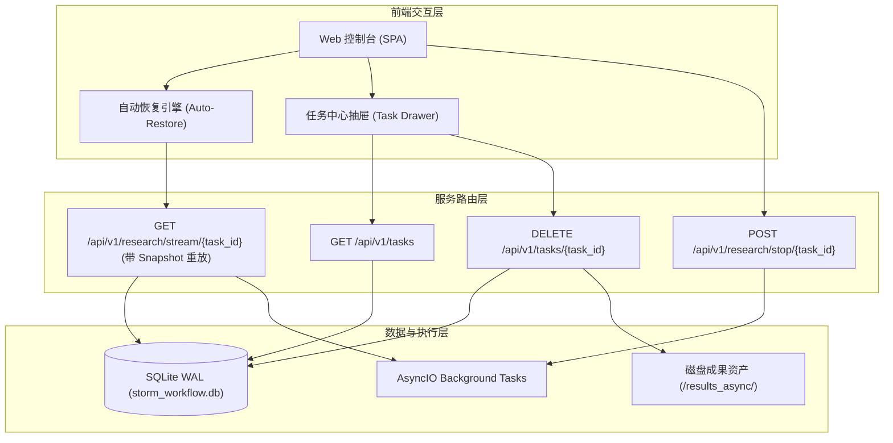

# STORM 任务管理与全链路状态恢复系统工程改造实录

## 1. 背景与缺陷定界

在早期版本中，STORM Web 控制台采用纯前端内存单任务模式（`let currentTaskId = null;`）。虽然底层具备 SQLite WAL 状态机持久化（[state_manager.py](file:///Users/ic/Project/storm/knowledge_storm/async_core/state_manager.py)），但前后端存在明显的交互断层：
1. **浏览器刷新状态丢失**：用户刷新页面或新开标签页后，前端 JS 内存重置，界面回归初始空表单，无法感知后台仍在执行或已完成的任务。
2. **缺乏多任务历史列表**：用户无法在 Web 端查看历史研究任务、无法在多个课题间无缝切换或清理过往成果。
3. **SSE 重连快照缺失**：客户端重新连接后，无法获知此前已完成阶段的进展（视角矩阵、事实沉淀数量、大纲等）。

---

## 2. 系统改造与架构设计

本次重构确立了 **“状态机为核心真理来源 (Single Source of Truth)”** 的任务全生命周期管理架构：

---

## 3. 核心功能落地细节

### 3.1 后端状态机与 REST API 增强
* **[state_manager.py](file:///Users/ic/Project/storm/knowledge_storm/async_core/state_manager.py)**：
  * 新增 `list_checkpoints(limit=50)`：秒级提取所有持久化任务的元数据（课题、阶段、视角数、事实数、正文字数、最后更新时间）。
  * 新增 `delete_checkpoint(task_id)`：支持从 SQLite 中原子级删除任务记录。
* **[server/app.py](file:///Users/ic/Project/storm/server/app.py)**：
  * 新增 `GET /api/v1/tasks`：聚合 SQLite 持久化元数据与内存 `RUNNING_TASKS` 活跃态，动态标记 `is_running`。
  * 新增 `POST /api/v1/research/stop/{task_id}`：支持用户在前端主动中断后台异步任务。
  * 新增 `DELETE /api/v1/tasks/{task_id}`：同步物理清理 SQLite 记录与 `./results_async/{task_id}` 目录。
  * **SSE 阶段快照回放机制**：当客户端新建立或重连 stream 时，首先下发 `STAGE_SNAPSHOT` 事件，回放已有课题、阶段与事实数据；若任务已在后台结束，则补发 `DONE` 事件并自动断开连接。

### 3.2 前端无缝恢复与任务管理中心
* **[index.html](file:///Users/ic/Project/storm/frontend/web/index.html)** 与 **[style.css](file:///Users/ic/Project/storm/frontend/web/style.css)**：
  * 导航栏新增 **“📁 任务列表 (N)”** 与 **“➕ 新建研究”** 快捷操作入口。
  * 引入大尺寸深色磨砂玻璃任务抽屉模态框 (`#tasksModal`)，支持查看课题卡片、状态 Badge（🟢 运行中 / ✅ 已完成 / ⏸️ 已中断 / ❌ 异常）、实时字数与删除操作。
* **[app.js](file:///Users/ic/Project/storm/frontend/web/app.js)**：
  * **页面加载自动恢复 (`initAutoRestore`)**：通过 `localStorage` 记录 `storm_last_task_id`，刷新页面自动恢复上次选中任务；若任务仍在运行则自动重连 SSE 流；若已完成则直接渲染正文、参考文献与导出按钮。
  * **多任务一键切换 (`selectTask`)**：点击任意历史任务卡片，即刻切换正文渲染与 5 阶段演进指示轴。
  * **一键新建 (`resetToNewTask`)**：清空左侧表单与右侧渲染，快速开启下一轮独立课题研究。

---

## 4. 验证与回归测试

1. **接口连通性验证**：`curl -s http://127.0.0.1:8000/api/v1/tasks` 成功返回包含 `storm_99a26b25` 在内的历史任务列表。
2. **页面重载与断点恢复**：启动服务后访问 Web 页面，自动检测并高亮完成态任务，正文、大纲、参考文献、Marp 幻灯片与 Typst 导出均立即可用。
