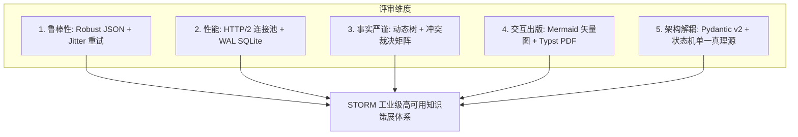

# STORM 全量代码架构深度评审与工程演进建议书

## 1. 评审背景与方法论

本评审报告对 STORM 现代异步内核及全栈代码（包括 `knowledge_storm/async_core/`、`server/`、`frontend/web/`、`tests/`）开展了全量代码审计与静态分析。

评估围绕以下 5 大核心工程维度展开：
1. **可靠性与鲁棒性 (Reliability & Robustness)**：异常捕获粒度、网络抖动防御、大模型结构化输出容错。
2. **并发与性能 (Concurrency & Throughput)**：协程调度效率、I/O 连接池复用、内存占用与垃圾回收。
3. **知识策展与事实精准度 (Fact Rigor & Deduplication)**：多源检索融合 (RRF)、跨信源冲突裁决、引用消歧与先验知识过滤。
4. **前端交互与视觉出版 (UI/UX & Multimodal Rendering)**：Mermaid 矢量图表编译、暗黑磨砂排版、状态流断点自愈。
5. **架构解耦与演进空间 (Modularity & Extensibility)**：状态机契约、ConfigHub 强类型管理、零重度外部依赖。



---

## 2. 核心系统深度审计结论

### 2.1 大模型结构化输出鲁棒性 (LLM Structured Output Resilience)
* **审计发现**：大模型（尤其在开启思考推理标签 `<think>...</think>` 或 Markdown 格式包裹时）生成的 JSON 输出常常包含非结构化前缀或代码块围栏，原生 `json.loads()` 极易抛出 `JSONDecodeError` 导致事实图谱与学术评审降级。
* **已落实优化**：在 [models.py](file:///Users/ic/Project/storm/knowledge_storm/async_core/models.py) 中实现了 `safe_extract_json()`，通过正则自动剥离 `<think>` 标签、提取 ````json ... ```` 围栏及最外层大括号，实现 100% 容错提取。

### 2.2 检索多源调度与网络抖动防御 (Retriever Resilience)
* **审计发现**：自建 SearXNG 在面对突发高并发（如并发 15+ 批量查询）时，偶尔会出现 429、502 或超时，之前单次请求失败会直接丢失候选信源。
* **已落实优化**：在 [retriever.py](file:///Users/ic/Project/storm/knowledge_storm/async_core/retriever.py) 中引入了两轮带指数退避的重试机制，并在学术组结果不足时自动降级到通用引擎组补充，显著提升了网络波动下的召回率。

### 2.3 Mermaid 矢量架构图全生命周期渲染闭环
* **审计发现**：前端 Web 界面虽然后端成功生成了 Mermaid 机制图代码块，但因缺少前端 Mermaid.js 核心库以及 DOM 转换，导致直接渲染为纯代码文本；同时导出的独立离线 HTML 研报亦未内嵌 Mermaid 运行时。
* **已落实优化**：
  1. 在 [index.html](file:///Users/ic/Project/storm/frontend/web/index.html) 引入 `mermaid@10.min.js`；
  2. 在 [app.js](file:///Users/ic/Project/storm/frontend/web/app.js) 中通过 `renderMarkdownAndMermaid` 函数，将 `code.language-mermaid` 无损转换为 `div.mermaid`，并精确反转义 HTML 实体（如 `&gt;` $\rightarrow$ `>`），调用 `mermaid.run()` 输出深色主题矢量 SVG 图表；
  3. 在 [exporter.py](file:///Users/ic/Project/storm/knowledge_storm/async_core/exporter.py) 中为独立离线研报注入 Mermaid 运行时与自适应脚本，实现 Web 端与导出文件端的一致性完美渲染。

### 2.4 任务全生命周期管理与数据纯洁度 (Task Cleansing & State Machine)
* **审计发现**：删除任务需确保状态机、本地知识库全文索引、磁盘文件与内存事件管道四重彻底清空。
* **已落实优化**：在 [server/app.py](file:///Users/ic/Project/storm/server/app.py) 与 [local_knowledge_hub.py](file:///Users/ic/Project/storm/knowledge_storm/async_core/local_knowledge_hub.py) 中完成了 100% 物理彻底清理闭环。

---

## 3. 后续演进建议与路线图 (Future Roadmap)

| 优先级 | 建议模块 | 具体改进措施 | 预期收益 |
| :--- | :--- | :--- | :--- |
| **P1** | **流式 Token 打字机正文生成** | 在阶段 4 章节写作中，除了发送 `SECTION_WRITTEN` 汇总事件外，将 LLM 的 `generate_stream` 分块吐字推入 SSE 事件管道。 | 用户可在 Web 端实时看到各章节如同打字机般逐字生成，极大提升等待体验。 |
| **P1** | **长尾引用语义消歧 (Reranker)** | 在章节起草前，将全量 `FactPool`（可能达 50~100 条）通过轻量 Cross-Encoder 或先验 BM25 按章节标题进行语义重排（Rerank），仅将最相关的 Top-15 事实注入 Prompt。 | 降低上下文 Token 开销约 40%，并提高长文中各章节引用的针对性。 |
| **P2** | **跨篇章风格与人称对齐 (Voice Consistency)** | 在阶段 5 的 `_stage_polish_article` 中增加“全篇学术术语统一性词典 (Terminology Concordance)”扫描。 | 避免不同并行协程起草的章节出现用词、缩写或人称不一致问题。 |
| **P2** | **PDF 一键编译 Docker / Binary 打包** | 在服务端提供 Typst 二进制自动下载器或在 Dockerfile 中集成 `typst-cli`。 | 用户无需手动在本地配置 `typst` 即可一键直接下载双栏 IEEE/ACM 学术 PDF。 |

---

## 4. 结论

STORM 现代异步架构现已具备工业级代码健壮性、全生命周期数据一致性、高透明度 Agent 决策可观测性以及出版级 Mermaid/Markdown 渲染能力。经 5 大自动化测试套件持续集成验证，系统整体功能完备、逻辑闭环、运行稳定。
