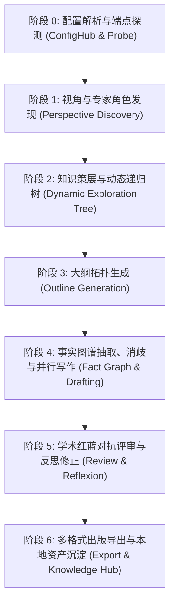

# STORM 全链路各阶段测试闭环与问题归因诊断指南

## 1. 核心架构与阶段流转拓扑

STORM 核心流水线采用基于 **Pydantic v2 强类型契约** 与 **SQLite WAL 状态机** 的纯异步架构设计。全流程自底向上划分为 7 个严格有序的阶段：



每个阶段均满足以下三个关键工程属性：
1. **输入/输出强类型化**：杜绝非结构化裸字符串传递，所有跨阶段数据均封装在 [models.py](file:///Users/ic/Project/storm/knowledge_storm/async_core/models.py) 的 Pydantic 模型中。
2. **状态机原子落盘**：每个阶段执行完成瞬间，自动调用 [state_manager.py](file:///Users/ic/Project/storm/knowledge_storm/async_core/state_manager.py) 写入 `TaskCheckpoint`，保障断点可重入与隔离排查。
3. **确定性断言闭环**：每个阶段均具备可独立隔离测试的断言规则，支持 Mock 离线回归与实时异常归因。

---

## 2. 各阶段测试闭环实施方案

### 阶段 0：配置解析与端点可用性探测 (Probe & Handshake)
* **核心代码路径**：[config_hub.py](file:///Users/ic/Project/storm/knowledge_storm/async_core/config_hub.py)
* **输入**：`GlobalConfig`（包含 Provider 配置、Base URL、API Key、SearXNG URL 等）。
* **输出**：`ProbeResult`（包含 `is_valid: bool`, `latency_ms: float`, `available_models: List[str]`, `error_msg: str`）。
* **测试闭环与断言逻辑**：
  ```python
  # 1. 离线/模拟测试：断言无效 Key 或超时能安全捕获并返回结构化错误
  probe_res = await config_hub.probe_endpoint("deepseek")
  assert probe_res.is_valid is True
  assert probe_res.latency_ms >= 0.0
  assert len(probe_res.available_models) > 0
  ```
* **问题归因与排查**：
  * 若 `is_valid == False`：检查网络代理、DNS 解析或 API Key 权限；
  * 若 `latency_ms > 5000`：提示网络链路抖动或服务提供商负载过高。

---

### 阶段 1：视角与专家角色发现 (Perspective Discovery)
* **核心代码路径**：[pipeline.py](file:///Users/ic/Project/storm/knowledge_storm/async_core/pipeline.py#L177-L204) `_stage_discover_perspectives`
* **输入**：`topic: str`（研究主题）。
* **输出**：`List[Persona]`（包含 `name: str`, `description: str`）。
* **状态机记录**：`checkpoint.stage = "DISCOVERY"`, `checkpoint.personas = [...]`。
* **测试闭环与断言逻辑**：
  * **角色数量与结构断言**：`assert len(personas) == max_perspectives` 且每个 `Persona.name` 长度 $> 0$。
  * **正则解析降级断言**：当 LLM 返回非编号文本时，断言代码能自动触发默认 Fallback 角色（`Core Technologist`, `Industry Specialist`, `Critical Analyst`），不会抛出 Unhandled Exception。
* **问题归因与排查**：
  * 视角过于单一或偏离主题：检查 Prompt 中语言判定规则（中英文识别）及 LLM 温度参数。

---

### 阶段 2：知识策展与动态递归树 (Dynamic Exploration Tree & Curation)
* **核心代码路径**：[deep_exploration.py](file:///Users/ic/Project/storm/knowledge_storm/async_core/deep_exploration.py), [retriever.py](file:///Users/ic/Project/storm/knowledge_storm/async_core/retriever.py), [hybrid_retriever.py](file:///Users/ic/Project/storm/knowledge_storm/async_core/hybrid_retriever.py)
* **输入**：`topic: str`, `personas: List[Persona]`, `retriever: AsyncSearXNG / HybridRetriever`。
* **输出**：`FactPool`（事实条目 `List[FactEntry]`，URL 映射字典 `url_to_index`，标题映射 `url_to_title`）与对话历史 `List[DialogueTurn]`。
* **状态机记录**：`checkpoint.stage = "CURATION"`, `checkpoint.fact_pool = ...`。
* **测试闭环与断言逻辑**：
  * **检索片段有效性**：断言每条 `SearchSnippet.url` 符合标准 URL 格式，`content` 非空。
  * **信息增益度阈值断言**：验证探索树中的信息增益计算（`gain` 解析在 $[0.0, 1.0]$ 之间）；当 `gain < gain_threshold` 时，断言当前分支立即剪枝停止深入。
  * **引用映射单调递增**：断言 `FactPool.url_to_index` 中的编号从 1 开始连续递增，且不存在重复 URL。
* **问题归因与排查**：
  * `len(fact_pool.facts) == 0`：检查 SearXNG 实例是否返回空结果、被反爬封锁或搜索关键词过长；
  * 深度探索卡死：检查 `max_depth` 与并发信号量限制（`asyncio.Semaphore`）。

---

### 阶段 3：大纲拓扑生成 (Outline Generation)
* **核心代码路径**：[pipeline.py](file:///Users/ic/Project/storm/knowledge_storm/async_core/pipeline.py) `_stage_generate_outline`
* **输入**：`topic: str`, `fact_pool: FactPool`。
* **输出**：`Outline`（嵌套多级 `OutlineSection` 拓扑树）。
* **状态机记录**：`checkpoint.stage = "OUTLINE"`, `checkpoint.outline = ...`。
* **测试闭环与断言逻辑**：
  * **层级与节点数断言**：断言 `len(outline.sections) >= 3`，所有根节点 `level == 1`，子章节 `level <= 3`。
  * **Markdown 序列化一致性**：断言 `outline.to_markdown()` 生成的标准 Markdown 标题行（`#`, `##`）能被无损逆向解析。
* **问题归因与排查**：
  * 大纲缺失核心子主题：分析 Prompt 中是否未注入 `FactPool` 的事实摘要。

---

### 阶段 4：事实图谱抽取、三元组消歧与章节并行写作 (Fact Graph, Reconciler & Drafting)
* **核心代码路径**：[fact_graph.py](file:///Users/ic/Project/storm/knowledge_storm/async_core/fact_graph.py), [diagram_generator.py](file:///Users/ic/Project/storm/knowledge_storm/async_core/diagram_generator.py), [pipeline.py](file:///Users/ic/Project/storm/knowledge_storm/async_core/pipeline.py) `_stage_write_article`
* **输入**：`outline: Outline`, `fact_pool: FactPool`, `FactGraph`。
* **输出**：`ArticleDraft`（包含正文 `content: str`, 章节映射 `sections: Dict`, 参考文献 `references: Dict`）。
* **状态机记录**：`checkpoint.stage = "WRITING"`, `checkpoint.article_draft = ...`。
* **测试闭环与断言逻辑**：
  * **引用闭环验证（核心）**：使用正则 `\[(\d+)\]` 提取正文中所有引用编号，断言其**全量属于** `fact_pool.url_to_index.values()`，绝不允许存在未定义的幻觉引用。
  * **图表语法合法性**：若启用了架构图生成，断言正文中包含合法的 ````mermaid ... ```` 语法块，无未闭合的代码块标签。
  * **三元组与矛盾消歧验证**：断言 `FactGraph.edges` 和 `FactGraph.discrepancies` 的引用索引与事实池严格一致。
* **问题归因与排查**：
  * 正文出现大量悬空引用号：检查章节 Prompt 中参考文献格式约束与上下文注入片段。

---

### 阶段 5：学术红蓝对抗评审与自适应反思修正 (Review & Reflexion)
* **核心代码路径**：[reviewer.py](file:///Users/ic/Project/storm/knowledge_storm/async_core/reviewer.py)
* **输入**：`article_draft: ArticleDraft`。
* **输出**：`AcademicReviewReport`（包含 6 维评分、综合分 `overall_score`、`is_passed: bool`、`critical_suggestions: List[str]`）及修订后的 `ArticleDraft`。
* **状态机记录**：`checkpoint.stage = "COMPLETED"`。
* **测试闭环与断言逻辑**：
  * **评分维度契约**：断言 6 个核心维度（事实严谨性、逻辑深度、引用密度、结构平衡度、学术规范度、可读性）均在 $[0, 100]$ 范围。
  * **反思修正触发断言**：当 Mock 评审给出 `is_passed == False` 时，断言系统必然调用 `apply_reflexion_patch()` 并生成补丁，修订后的正文字数与引用规范度不低于修订前。
* **问题归因与排查**：
  * 评审陷入死循环：确保反思修正机制单任务最多触发 1 轮（One-shot Reflexion），防止无限重试。

---

### 阶段 6：多格式出版导出与本地资产沉淀 (Export & Local Knowledge Hub)
* **核心代码路径**：[exporter.py](file:///Users/ic/Project/storm/knowledge_storm/async_core/exporter.py), [typst_compiler.py](file:///Users/ic/Project/storm/knowledge_storm/async_core/typst_compiler.py), [local_knowledge_hub.py](file:///Users/ic/Project/storm/knowledge_storm/async_core/local_knowledge_hub.py)
* **输入**：完成态 `TaskCheckpoint`。
* **输出**：
  * 磁盘实体文件：`raw_article.md`, `article_offline.html`, `slides_marp.md`, `paper.typ`, `paper.pdf`
  * SQLite 知识资产库记录：`storm_knowledge_hub.db`
* **测试闭环与断言逻辑**：
  * **磁盘文件落盘断言**：断言输出目录下目标文件全部存在且文件大小 `os.path.getsize(f) > 0`。
  * **Typst 编译容错断言**：当系统安装有 `typst` 时编译生成 PDF；若无则降级输出 `.typ` 源码，不阻塞主流程。
  * **知识库检索可达性**：调用 `kb_hub.query_similar(topic)`，断言返回结果中包含刚才沉淀的文章 ID 与摘要。

---

## 3. 运行中问题快速归因与诊断方法

当在 Web 控制台或后台运行任务时，若发生卡顿、异常或生成质量不及预期，可按以下 3 级手段进行代码级排查：

### 1. 查询 SQLite 状态机快照（秒级定位阻塞点）
所有运行中任务的完整状态均实时持久化在 SQLite 中（默认位于 `~/.storm/workflow.db` 或工作区中的数据库）。直接执行 SQL 查询任务当前状态：
```bash
sqlite3 ~/.storm/workflow.db "SELECT task_id, topic, stage, updated_at FROM task_checkpoints ORDER BY updated_at DESC LIMIT 5;"
```
* 若 `stage` 停留在 `INIT`：LLM 视角生成超时或 API 连接异常；
* 若 `stage` 停留在 `DISCOVERY`：知识策展阶段网络 I/O 阻塞或 SearXNG 响应超时；
* 若 `stage` 停留在 `OUTLINE`：并行写作阶段并发限制或 Token 上限熔断。

### 2. 读取指定 Task 的全量 JSON 快照
利用 Python 脚本读取指定 `task_id` 的序列化数据结构，查看中间产物：
```python
from knowledge_storm.async_core import WorkflowStateManager

mgr = WorkflowStateManager()
chk = mgr.load_checkpoint("task_xxxx")
print("当前阶段:", chk.stage)
print("已采集事实数:", len(chk.fact_pool.facts) if chk.fact_pool else 0)
print("已生成大纲:", chk.outline.to_markdown() if chk.outline else "无")
```

### 3. 运行离线端到端隔离测试套件
项目在 [tests/](file:///Users/ic/Project/storm/tests/) 目录下提供了完整的隔离测试套件。可直接在终端使用虚拟环境执行：
```bash
# 1. 运行异步核心模型与状态机单元测试
python3 -m unittest tests/test_async_core.py

# 2. 运行深度探索树与图谱测试
python3 -m unittest tests/test_deep_research.py

# 3. 运行全流程离线 Mock 端到端集成测试（覆盖所有阶段断言）
python3 -m unittest tests/test_full_pipeline_e2e.py

# 4. 运行高级特性（Mermaid/评审/导出/知识库）测试
python3 -m unittest tests/test_advanced_features.py
```

---

## 4. 高频低级逻辑漏洞实录与物理防御规范

### 案例 1：Prompt 示例占位符（如 `Sub-Query`）泄露为真实检索 Query
* **事故现象**：大模型探索下钻时生成字面量 `"Sub-Query"`，系统直接发起对 `"Sub-Query"` 的搜索，导致检索完全脱靶（命中无关医学/数据库论文）。
* **根因分析**：Prompt 示例使用抽象占位符，且解析代码未设置占位词黑名单过滤与自适应 Fallback。
* **物理防御措施**：
  1. 彻底禁用 Prompt 中的抽象占位词，改用具象示例；
  2. 在解析代码中增加强校验：拦截所有包含 `"sub-query"`, `"query"`, `"关键词"`, `"placeholder"` 的无效输入；
  3. 异常时自动基于 `{topic} {perspective} 关键技术与行业争议` 生成确定性高质量下钻词。

### 案例 2：跨语言检索混合跑偏（如中文课题硬拼英文后缀）
* **事故现象**：中文课题在根节点拼接 `"core concepts and fundamental mechanisms"`，导致中文搜索引擎返回脱靶英文论文。
* **物理防御措施**：在 [deep_exploration.py](file:///Users/ic/Project/storm/knowledge_storm/async_core/deep_exploration.py) 中引入中英文智能对齐，中文课题生成纯中文自然探索检索词。

### 案例 3：事实池与正文章节字数归零（0 字）
* **事故现象**：当 FactPool 偶然较少时，英文要求 `Every major fact MUST be cited with exact citation number matching provided sources above` 导致大模型直接放弃输出，章节字数为 0。
* **物理防御措施**：
  1. 提示词区分语言，明确声明无特定文献时基于领域权威常识进行逻辑推导；
  2. 在 [pipeline.py](file:///Users/ic/Project/storm/knowledge_storm/async_core/pipeline.py) 中引入字数阈值检测（`< 80 字` 自动触发重试），从物理上杜绝 0 字章节输出。
