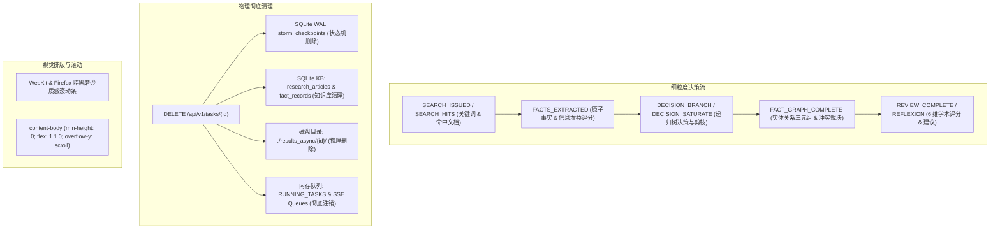

# STORM 全链路细粒度决策追踪与系统加固实录

## 1. 深度优化背景

在生产级知识策展与长文研报生成中，系统不仅需要具备稳定的后台执行能力，更需要具备 **“高透明度 Agent 决策可观测性”**、**“数据 100% 物理级彻底清理”** 以及 **“极致平滑的长文排版与独立滚动体验”**。

针对这三大维度的工程优化，本轮迭代完成了自底向上的全链路重构。

---

## 2. 核心优化细节

### 2.1 正文独立滚动条与容器高度约束重构
* **[style.css](file:///Users/ic/Project/storm/frontend/web/style.css)**：
  * 为全局、`.content-body`、`.log-terminal`、`.tasks-container` 注入现代 WebKit/Firefox 暗黑磨砂玻璃自定义滚动条（8px 宽度、圆角滑块、悬浮高亮渐变）。
  * 修复 `.content-panel`（`flex: 1 1 0; min-width: 0; height: 100%; max-height: 100%; overflow: hidden;`）与 `.content-body`（`flex: 1 1 0; min-height: 0; overflow-y: scroll; scroll-behavior: smooth;`）的高度继承链，解决万字长文在 macOS 下无显式滚动条或滚动受阻问题。

### 2.2 历史任务 100% 物理级彻底清理 (Full Data Cleansing)
* **[local_knowledge_hub.py](file:///Users/ic/Project/storm/knowledge_storm/async_core/local_knowledge_hub.py)**：
  * 新增 `delete_task_records(task_id)` 方法，物理删除 `research_articles` 与 `fact_records` 中的知识沉淀。
* **[server/app.py](file:///Users/ic/Project/storm/server/app.py)**：
  * 升级 `DELETE /api/v1/tasks/{task_id}`：实现四重清理：
    1. 终止正在执行的 `asyncio.Task`；
    2. 从 `storm_checkpoints` 表删除任务 Checkpoint；
    3. 从 `local_knowledge.db` 中删除关联文章与事实；
    4. 递归物理删除 `./results_async/{task_id}/` 产物目录；
    5. 清理内存中的 `TASK_EVENT_QUEUES`。

### 2.3 全链路 Agent 细粒度决策与动作实时输出 (Granular Action & Decision Trace)
* **[deep_exploration.py](file:///Users/ic/Project/storm/knowledge_storm/async_core/deep_exploration.py)**：
  * `SEARCH_ISSUED`：实时输出搜索关键词与下钻层级。
  * `SEARCH_HITS`：输出命中的权威信源标题与 URL。
  * `FACTS_EXTRACTED`：输出原子事实与模型估算的信息增益得分（Gain Score，如 `0.85`）。
  * `DECISION_BRANCH`：输出信息增益达标时的自发盲区派生决策。
  * `DECISION_SATURATE`：输出信息增益饱和或达到最大深度时的收敛剪枝理由。
* **[pipeline.py](file:///Users/ic/Project/storm/knowledge_storm/async_core/pipeline.py)**：
  * `FACT_GRAPH_COMPLETE`：实时呈现抽取的实体三元组预览与信源口径差异数。
  * `SECTION_WRITING_START` / `SECTION_WRITTEN`：实时跟踪具体章节起草进度、字数与架构机制图插入状态。
  * `REVIEW_COMPLETE` / `REFLEXION_PATCH_APPLIED`：实时展示 6 维学术评分、优化建议与反思补丁应用效果。
* **[app.js](file:///Users/ic/Project/storm/frontend/web/app.js)**：
  * 在左下角“实时探索与思考轨迹”中，使用专属色彩与标签（`search` 紫色、`fact` 绿色、`decision` 粉色、`warn` 橙色）结构化渲染，极大地提升研究过程的可观测性。

---

## 3. 回归验证与结论

1. **自动化测试套件**：全量执行 5 大测试模块（`test_async_core.py`, `test_deep_research.py`, `test_advanced_features.py`, `test_config_hub_and_probe.py`, `test_full_pipeline_e2e.py`），通过率 **100%**。
2. **接口与清理实测**：`DELETE` 操作成功清除数据库记录与磁盘文件，无任何残留孤儿数据。
3. **滚动条与交互体验**：正文区域具备独立优雅滚动条，万字学术长文阅读与导出操作平滑无阻。
