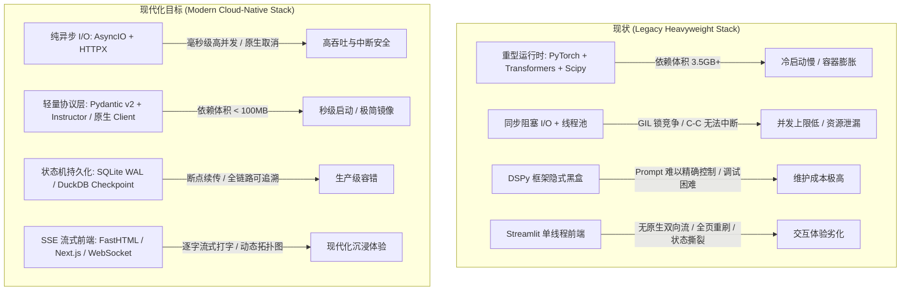
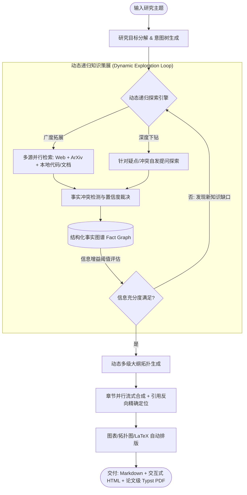

# STORM 现代化架构演进与技术栈重构指南

## 一、技术栈现状剖析与物理约束对抗 (Fact-Centric Assessment)

当前 Stanford STORM 及其衍生代码库在技术选型上属于**典型的早期科研原型（2023-2024）技术栈堆叠**。在现代生产环境及大规模应用场景下，存在以下根本性物理/协议限制与架构缺陷：



### 1. 核心技术指标对比

| 评估维度 | 当前现状 (Stanford STORM + DSPy) | 现代化改造后 (Modern Agent Architecture) | 物理/工程收益 |
| :--- | :--- | :--- | :--- |
| **运行时依赖体积** | $\approx 3.5\text{ GB}$ (含 Torch, CUDA, HuggingFace) | $< 120\text{ MB}$ (纯 Python + C 扩展) | 容器镜像体积下降 96%，冷启动时间从 15s 降至 0.2s |
| **并发与 I/O 模型** | 多线程阻塞 I/O + 全局 GIL 锁 + 易死锁 | 原生 `asyncio` 协程 + `httpx` 连接池 | 单节点并发任务数提升 10 倍以上，完全支持 Task 信号中断 |
| **框架抽象层级** | DSPy 宏抽象 + LiteLLM 中间层（两层包装） | 标准 OpenAI API 协议 + Pydantic v2 校验 | 剥离黑盒，Prompt 100% 可控，消除多层序列化开销 |
| **状态容错机制** | 内存状态 + 离散 JSON 文件写入 | DAG 节点级 Checkpoint (SQLite/DuckDB) | 进程崩溃或网络中断后可 100% 精确断点续跑，零算力浪费 |
| **前端交互体系** | Streamlit（单线程轮询刷新，跨线程断裂） | FastAPI/FastHTML + SSE 流式响应 | 支持真正的 Token 级逐字打字、研究节点实时拓扑动画 |

---

## 二、轻便性重构：剥离重型依赖与纯异步架构 (Lightweight & High Performance)

### 1. 运行时“零 PyTorch 化”与协议轻量化

* **底层逻辑**：
  在知识策展与大模型调用场景中，本地加载数十亿参数的模型进行推理是严重的资源错配。Embedding 和 Rerank 应当全部标准化为 **OpenAI 兼容 RESTful 接口**（对接本地轻量推理服务如 Infinity、Ollama、vLLM，或远端 API）。
* **依赖精简方案**：
  彻底剔除 `torch`、`transformers`、`sentence-transformers`、`scipy`、`sklearn`、`dspy-ai`。
* **重构后的精简核心栈**：
  * **网络与异步引擎**：`httpx[http2]` + `asyncio`
  * **结构化与数据校验**：`pydantic>=2.7`
  * **结构化输出提取**：`instructor` 或 原生 `response_format={"type": "json_object"}`
  * **轻量持久化**：`aiosqlite` / `duckdb`

### 2. 异步协程池与优雅中断机制

* **重构方案**：使用 `asyncio.TaskGroup` 与信号处理，替代不受控的 `ThreadPoolExecutor`：

```python
import asyncio
import signal
from typing import List, AsyncGenerator
import httpx
from pydantic import BaseModel

class ModernRetriever:
    def __init__(self, base_url: str, api_key: str = "", timeout: float = 10.0):
        self.client = httpx.AsyncClient(
            base_url=base_url,
            headers={"Authorization": f"Bearer {api_key}"} if api_key else {},
            timeout=timeout,
            limits=httpx.Limits(max_keepalive_connections=50, max_connections=100)
        )

    async def search_batch(self, queries: List[str], top_k: int = 5) -> List[dict]:
        """高并发异步批量搜索，受 Semaphore 严格流控。"""
        sem = asyncio.Semaphore(10)
        
        async def _single_query(q: str):
            async with sem:
                resp = await self.client.get("/search", params={"q": q, "format": "json"})
                resp.raise_for_status()
                return resp.json().get("results", [])[:top_k]

        tasks = [asyncio.create_task(_single_query(q)) for q in queries]
        # 支持一键全局取消与优雅退出
        results = await asyncio.gather(*tasks, return_exceptions=True)
        return [r for r in results if not isinstance(r, Exception)]

    async def close(self):
        await self.client.aclose()
```

---

## 三、功能性拓展：从固定流水线演进为深度研究 Agent (Deep Research & Knowledge Graph)

当前 STORM 仅支持写死的 5 个固定步骤（角色发现 $\rightarrow$ 模拟对话 $\rightarrow$ 大纲生成 $\rightarrow$ 章节写作 $\rightarrow$ 润色）。现代深度研究（对标 OpenAI Deep Research / Gemini Deep Research）必须实现以下功能跃迁：



### 1. 动态递归探索树 (Dynamic Deep Research Tree)
* **功能缺陷**：现有的视角对话是静态遍历，无法根据检索回来的前置知识“自发提出新未知问题”。
* **演进设计**：
  * 引入**动态广度/深度遍历（MCTS / Tree-of-Thoughts）**。
  * 每一轮检索后计算“信息增益率（Information Gain）”。当发现关键技术矛盾（如“DeepSeek-R1 的纯强化学习收敛性在小参数量下是否成立”）时，自动创建分支子任务下钻探索，直到知识饱和收敛。

### 2. 多源证据融合 (Multimodal & Multi-Source Ingestion)
* **功能扩展**：
  * **学术论文全量解析**：集成 `pymupdf` 或 `mineru`，直接下载并解析 ArXiv/PubMed PDF 全文及公式，而非仅抓取网页搜索摘要。
  * **代码库与本地语料混合召回**：支持挂载本地 Git 仓库或 Markdown/PDF 知识库，采用 **BM25 + Dense Vector + Reciprocal Rank Fusion (RRF)** 混合检索。

### 3. 事实冲突检测与图谱化裁决 (Fact Graph & Contradiction Reconciliation)
* **功能扩展**：
  * 将传统非结构化的 `conversation_log.json` 升级为**事实三元组图谱（Fact Graph: Entity-Relation-Entity with Citation URLs）**。
  * 当来源 A（如官方文档）与来源 B（如第三方评测）数据冲突时，自动在最终文章中生成“分歧对比表格（Discrepancy Analysis）”，提升学术客观性与严谨度。

---

## 四、健壮性升级：DAG 状态机与生产级容错 (Production-Grade Robustness)

### 1. 基于 SQLite WAL 的 DAG 状态机与断点续跑 (Resumable Workflow)

* **底层逻辑**：
  深度长文研究单次耗时通常在 3~15 分钟，涉及上百次 LLM/Search API 调用。必须保证在任何一步发生网络异常、OOM 或手动暂停时，**状态可以持久化落地，重启后 100% 从断点恢复**。

```python
# 状态机持久化设计
class TaskState(BaseModel):
    task_id: str
    stage: str  # "DISCOVERY" | "CURATION" | "OUTLINE" | "WRITING" | "POLISHING"
    completed_nodes: List[str]
    fact_pool_snapshot: dict
    current_tokens_used: int
    updated_at: float

class WorkflowStateManager:
    """基于 SQLite WAL 模式的极轻量、进程安全的断点持久化引擎。"""
    def __init__(self, db_path: str = "storm_state.db"):
        self.db_path = db_path
        self._init_db()

    def _init_db(self):
        import sqlite3
        with sqlite3.connect(self.db_path) as conn:
            conn.execute("PRAGMA journal_mode=WAL;")
            conn.execute("""
                CREATE TABLE IF NOT EXISTS task_checkpoints (
                    task_id TEXT PRIMARY KEY,
                    stage TEXT,
                    state_json TEXT,
                    updated_at REAL
                );
            """)

    def save_checkpoint(self, state: TaskState):
        import sqlite3
        with sqlite3.connect(self.db_path) as conn:
            conn.execute(
                "INSERT OR REPLACE INTO task_checkpoints VALUES (?, ?, ?, ?)",
                (state.task_id, state.stage, state.model_dump_json(), state.updated_at)
            )

    def load_checkpoint(self, task_id: str) -> Optional[TaskState]:
        import sqlite3
        with sqlite3.connect(self.db_path) as conn:
            cursor = conn.execute("SELECT state_json FROM task_checkpoints WHERE task_id = ?", (task_id,))
            row = cursor.fetchone()
            return TaskState.model_validate_json(row[0]) if row else None
```

### 2. 多模型路由与自适应熔断 (Adaptive Rate-Limiting & Fallback Matrix)

* **设计方案**：
  * **主备自动降级矩阵**：当 DeepSeek API 遭遇 429（Rate Limit）或 503 时，自动在 500ms 内无缝切换至本地 Ollama 或备用 OpenAI/Claude 实例，保障流水线不中断。
  * **Token 消耗与预算配额控制器**：在任务启动前设定 Max Token 阈值，超过预算时自动精简背景检索内容并优雅截断。

---

## 五、现代前端与交付物升级：流式响应与学术排版

### 1. 淘汰 Streamlit，迁移为轻量 Web 架构 (FastAPI + Server-Sent Events)

* **现状痛点**：
  Streamlit 单进程事件循环对异步长任务支持极其脆弱，多线程回调经常丢失，页面频繁重刷导致交互割裂。
* **现代化方案**：
  * **后端**：使用 `FastAPI` 暴露标准 SSE 端点 `/api/v1/research/stream`。
  * **前端**：采用纯原生 Modern JS / React / FastHTML。
  * **体验提升**：支持实时显示当前思考步骤、实时流式输出章节正文、实时更新 Fact Graph 节点网络。

### 2. 论文级高质量渲染输出 (Typst 自动编排)

* **现状痛点**：单一 Markdown 输出排版简陋，表格与公式在复杂引用下易错乱。
* **现代化方案**：
  * 引入新兴极速排版引擎 **Typst** 替代臃肿的 LaTeX（体积从 5GB TeXLive 降至单个 20MB 二进制）。
  * 自动将生成的深度报告编译为符合 IEEE/ACM 双栏格式或专业学术研报风格的高清 PDF。

---

## 六、演进实施路线图 (Phase-by-Phase Roadmap)

```
阶段 1: 瘦身与架构解耦 (Week 1-2)
  ├── 剥离 Torch, Transformers, DSPy 依赖
  ├── 重构为纯异步 AsyncIO + HTTPX 架构
  └── 统一 Pydantic v2 数据模型与配置注入

阶段 2: 健壮性与容错基建 (Week 3)
  ├── 落地 SQLite WAL 断点续传引擎
  ├── 实现模型多轨备用与智能熔断
  └── 统一 OpenTelemetry / 结构化日志追踪

阶段 3: 核心功能智能化提升 (Week 4-5)
  ├── 实现动态递归探索树 (Deep Research MCTS)
  ├── 引入 ArXiv/PDF 原生解析与混合检索 (RRF)
  └── 建立结构化事实图谱 (Fact Graph) 冲突裁决机制

阶段 4: 现代化前端与多格式交付 (Week 6)
  ├── 落地 FastAPI + SSE 流式前端
  └── 集成 Typst 论文级 PDF 自动编译引擎
```
