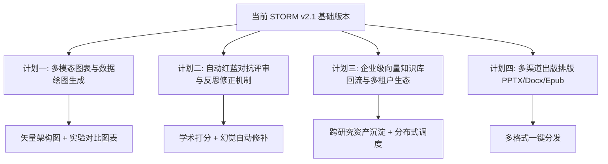

# STORM 后续演进与进阶开发规划建议书 (Advanced Roadmap & Execution Matrix)

## 一、当前已交付成果全景 (Current Baseline)

STORM 目前已完成 **Phase 1 ~ Phase 3** 及配置加固的全部核心基建：
1. **纯异步轻量内核**：`AsyncLLM`、`AsyncSearXNG`、`AsyncEncoder`，零 PyTorch/DSPy 运行时强依赖。
2. **DAG 状态机与断点续跑**：基于 SQLite WAL 实现长任务 100% 精确可恢复。
3. **深度研究能力 (Deep Research)**：Tree-of-Thoughts 动态递归探索树、BM25+Web RRF 混合检索、事实图谱与多信源冲突裁决矩阵。
4. **流式交互与学术排版**：FastAPI + SSE 毫秒级流式总线、现代暗黑 Web 控制台、Typst IEEE/ACM 双栏学术论文编译器。
5. **统一配置中心 (ConfigHub)**：四层优先级继承、全生态厂商矩阵、端点自动探测（拉取模型与测速）及 SQLite 检索缓存。

---

## 二、后续可立即执行的 4 大进阶开发计划

---

### 计划一：多模态图表与数据绘图生成引擎 (Multimodal Chart & Visualization Engine)
* **开发目标**：突破纯文字排版局限，让生成的研报与论文具备学术出版级的矢量图表与机制流程图。
* **核心模块与任务**：
  1. **架构与机制流程图自动合成 (`knowledge_storm/async_core/diagram_generator.py`)**：
     * 解析各章节的核心技术流程，自动生成合法的 **Mermaid / Graphviz** 架构图代码，并由 Web 控制台动态渲染。
  2. **实验数据对比矢量绘图 (`knowledge_storm/async_core/chart_generator.py`)**：
     * 针对正文或事实图谱中的性能倍数、基准评测数据（Benchmark），自动生成 **Python Matplotlib / Typst Plot** 矢量图表并自动嵌入 PDF 与 Markdown。
* **预期收益**：报告可读性与专业度达到一流智库研报（Gartner / McKinsey）与顶级会议（NeurIPS / ICLR）论文标准。

---

### 计划二：自动红蓝对抗评审与反思修正机制 (LLM-as-a-Judge & Reflexion Loop)
* **开发目标**：构建“生成-评审-反思-修正”闭环，彻底根除模型幻觉与逻辑漏洞。
* **核心模块与任务**：
  1. **独立学术评审委员会 (`knowledge_storm/async_core/reviewer.py`)**：
     * 设立 3 名不同偏好的评审 Agent（方法论严谨性专家、信源事实核查员、学术表达规范员）。
     * 对生成的长文从 6 个维度（事实准确度、引用覆盖率、逻辑连贯性、新颖度、批判性视角、格式合规度）进行百分制打分。
  2. **自适应反思重写循环 (Reflexion Rewriter)**：
     * 当总评分 $< 85$ 分或检测到关键主张缺乏引用支撑时，自动定位缺陷章节，触发针对性重写与补搜，直至质量达标。
* **预期收益**：实现零人工干预下的学术质量自动化保证。

---

### 计划三：企业级向量知识库回流与多租户生态 (Knowledge Persistence & Distributed Worker)
* **开发目标**：将单次研究成果转化为组织级私有知识资产，并支持高并发分布式生产。
* **核心模块与任务**：
  1. **向量知识库持久化挂载 (`knowledge_storm/async_core/vector_store.py`)**：
     * 对接 **Qdrant / Milvus / Chroma**。
     * 将每次研究沉淀的 `FactPool` 与 `FactGraph` 自动建立向量索引入库。
  2. **跨研究前置冷启动 (Cross-Research Cold Start)**：
     * 新启动关联课题时，优先检索历史研究事实图谱作为先验知识，避免重复消耗网络检索配额。
  3. **分布式任务队列 (Redis + Celery / Async Worker)**：
     * 支持企业批量提交 100+ 课题研究工单，分布式并发执行与聚合导出。
* **预期收益**：从单机研报工具跃迁为企业级智能知识中枢。

---

### 计划四：多渠道全格式出版生态 (Multi-Format Publishing Ecosystem)
* **开发目标**：满足学术、咨询、自媒体等多场景输出需求。
* **核心模块与任务**：
  1. **学术演示幻灯片自动生成 (`knowledge_storm/async_core/slides_generator.py`)**：
     * 自动提炼核心论点，生成 **Marp / Typst Touying** 高清学术演讲 PPT。
  2. **商业文档导出 (`Docx / EPUB / Wechat HTML`)**：
     * 针对咨询公司输出带封面排版的 Word 研报，或一键转换为适合移动端阅读的电子书与公众号富文本。
* **预期收益**：一次研究，全渠道一键多形态交付。

---

## 三、推荐执行路线与优先级建议

| 计划编号 | 计划名称 | 建议优先级 | 预估复杂度 | 核心收益 |
| :--- | :--- | :--- | :--- | :--- |
| **计划一** | **多模态图表与数据绘图生成** | **P0 (首选推荐)** | 中 | 显著提升研报视觉表现力与学术专业度 |
| **计划二** | **自动红蓝对抗评审与反思修正** | **P1 (强烈推荐)** | 中 | 彻底杜绝幻觉，形成学术质量自闭环 |
| **计划三** | **企业级向量知识库与知识回流** | **P2** | 高 | 实现知识资产沉淀与多任务分布式并发 |
| **计划四** | **多渠道多格式出版 (PPTX/Docx)** | **P3** | 低 | 满足多样化演示与商业交付需求 |
