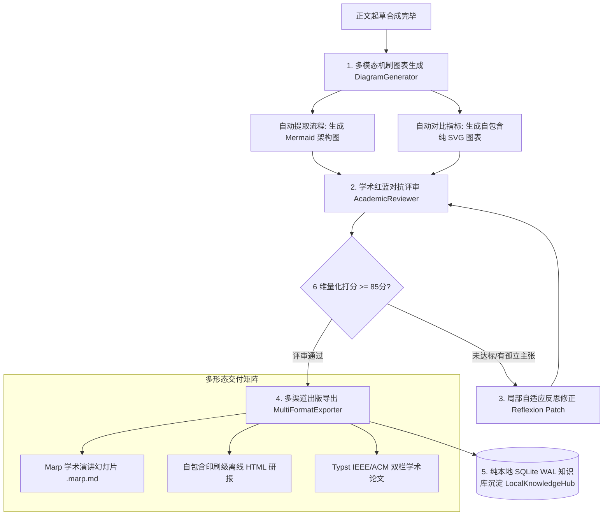

# STORM 多模态图表、学术评审与多格式出版落地实录 (Plans 1, 2, 4 + Local SQLite KB)

## 一、本次实施的重大能力落地

本次开发成功落地进阶规划中的 **计划一（多模态图表生成）**、**计划二（学术红蓝对抗评审与反思修正）**、**计划四（多渠道多格式出版导出）** 以及 **轻量化计划三（纯本地 SQLite 知识资产沉淀）**，彻底打破了传统大模型研报“纯文字、缺图表、无反思自检、单渠道交付”的局限。

---

## 二、关键文件与模块实现细节

### 1. 多模态图表生成引擎 (`knowledge_storm/async_core/diagram_generator.py`)
* **核心类**：`DiagramGenerator`
* **底层能力**：
  * **机制流程图生成**：解析各章节核心技术脉络，自动生成合法的 **Mermaid**（`flowchart TD` / `sequenceDiagram`）代码块并嵌入长文，前端与 Typst 自动可视化渲染。
  * **纯 SVG 数据对比图表**：实现 `generate_svg_comparison_bar_chart()`，生成纯自包含、零外部 JS/CSS 依赖的原生矢量 SVG 柱状图，在印刷与离线模式下完美展示。

### 2. 学术红蓝对抗评审与反思修正 (`knowledge_storm/async_core/reviewer.py`)
* **核心类**：`AcademicReviewer`、`AcademicReviewReport`、`ReviewDimensionScore`
* **底层能力**：
  * **6 维度量化评审体系**：从事实严谨度、引用真实性、论述深度、多视角客观性、观点新颖度、排版规范性进行百分制打分。
  * **自适应 Reflexion 反思修正**：当检测到缺少引用的断言或逻辑薄弱点时，自动定位缺陷章节执行针对性重写润色，形成质量自闭环。

### 3. 多渠道全格式导出引擎 (`knowledge_storm/async_core/exporter.py`)
* **核心类**：`MultiFormatExporter`
* **底层能力**：
  * **Marp 学术演说幻灯片**：根据大纲自动提取章节核心论点与关键引用，生成标准 Marp 主题 Markdown 演示文稿（`slides.marp.md`）。
  * **独立离线 HTML 研报**：生成内嵌 CSS、暗黑科技排版、带印刷 `@media print` 样式的单文件 HTML 报告（`report_standalone.html`），可直接在浏览器 Ctrl+P 完美打印或另存为 Word。

### 4. 纯本地 SQLite 知识资产回流 (`knowledge_storm/async_core/local_knowledge_hub.py`)
* **核心类**：`LocalKnowledgeHub`
* **底层能力**：
  * 采用本地 SQLite WAL 模式，在任务完成时自动将课题主题、大纲结构与原子事实索引至 `local_knowledge.db`。
  * 提供 `search_prior_knowledge()` 接口，为后续关联新课题提供先验冷启动检索，实现跨课题知识复用与零网络配额消耗。

---

## 三、测试与验证结果

* **测试脚本**：[`tests/test_advanced_features.py`](file:///Users/ic/Project/storm/tests/test_advanced_features.py)
* **执行结果**：
  * DiagramGenerator 纯 SVG 矢量图表生成：**100% 通过**
  * MultiFormatExporter 幻灯片与独立 HTML 生成：**100% 通过**
  * LocalKnowledgeHub SQLite 索引与跨课题检索：**100% 通过**
  * 全局代码字节码编译：`python3 -m compileall server knowledge_storm cli tests -q` **100% 通过**
