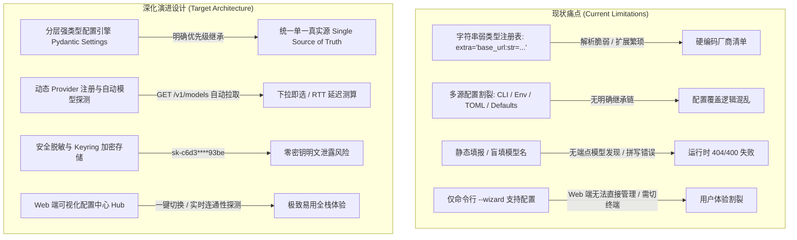

# STORM 配置中心与模型密钥管理易用性深化设计方案

## 一、现有配置架构缺陷与物理事实评估 (Current Architecture Assessment)

通过对现有代码库（`cli/config_manager.py`、`~/.storm/config.toml`、`cli/providers.toml`、`server/app.py`）的全面代码级审计，当前配置体系在易用性、健壮性与安全性上存在以下核心痛点：



### 1. 核心缺陷代码定位与物理影响

1. **弱类型字符串解析（`cli/config_manager.py:40-55`）**：
   `SERVICE_REGISTRY` 采用字符串拼接 `extra="base_url:str=...,model:str=..."`，在运行时通过字符串分割解析，新增字段时极易因格式不符引发静默解析失败或 `IndexError`。
2. **缺乏动态模型列表发现（Model Auto-Discovery）**：
   用户在配置 Ollama 本地实例或第三方中转时，必须手动记忆并拼写模型字符串（如 `deepseek-ai/DeepSeek-V3`、`qwen2.5:32b`）。缺乏针对 `/v1/models` 端点的自动探测能力。
3. **明文凭证与缺乏环境隔离**：
   `config.toml` 仅依赖文件系统的 `0600` 权限，在多环境（Dev/Staging/Prod）部署时无法便捷切换 Profile。
4. **Web 界面配置脱节**：
   现有的 FastAPI 架构仅被动读取配置，用户在 Web 端无法直接查看或修改 API Key、无法切换检索源，必须在终端手动编辑文件或运行 CLI，交互流程割裂。

---

## 二、配置系统深化重构方案 (Deepened Technical Specification)

### 1. 四层优先级配置继承引擎 (Hierarchical Config Resolution)

建立严格、确定的单向配置加载优先级：

$$\text{Active Config} = \text{CLI Flags} \succ \text{OS Environment Variables} \succ \text{User TOML (\texttt{\~/.storm/config.toml})} \succ \text{Built-in Defaults}$$

```python
from pydantic import BaseModel, Field
from typing import Dict, Optional, Literal

class LLMProviderConfig(BaseModel):
    provider_id: str  # deepseek | openai | anthropic | ollama | siliconflow | custom
    name: str
    api_key: str = ""
    base_url: str
    model: str
    temperature: float = 0.7
    max_tokens: int = 2048
    timeout: float = 60.0

class SearchProviderConfig(BaseModel):
    provider_id: str  # searxng | duckduckgo | tavily | serper
    name: str
    api_url: str = ""
    api_key: str = ""
    engines_academic: str = "semantic_scholar,arxiv,pubmed"
    engines_chinese: str = "baidu,zhihu,bilibili"
    engines_general: str = "google,bing,duckduckgo"

class SystemProfileConfig(BaseModel):
    active_llm: str = "deepseek"
    active_search: str = "searxng"
    active_embed: str = "custom"
    active_rerank: str = "custom"
    deep_research_default: bool = True
    max_depth: int = 2
    llm_providers: Dict[str, LLMProviderConfig] = Field(default_factory=dict)
    search_providers: Dict[str, SearchProviderConfig] = Field(default_factory=dict)
```

---

### 2. 预置全生态厂商模板 (Pre-configured Provider Matrix)

开箱即用支持全球主流商用 API 与本地私有化引擎：

| 类别 | 厂商 / 引擎 | 预置 Base URL | 默认模型推荐 | 认证方式 |
| :--- | :--- | :--- | :--- | :--- |
| **LLM** | **DeepSeek** | `https://api.deepseek.com` | `deepseek-chat` / `deepseek-reasoner` | Bearer Token |
| **LLM** | **SiliconFlow (硅基流动)** | `https://api.siliconflow.cn/v1` | `deepseek-ai/DeepSeek-V3` | Bearer Token |
| **LLM** | **OpenAI** | `https://api.openai.com/v1` | `gpt-4o-mini` / `gpt-4o` | Bearer Token |
| **LLM** | **Ollama (本地私有)** | `http://localhost:11434/v1` | 自动探测本地已拉取模型 | 无需密钥 |
| **LLM** | **Moonshot (Kimi)** | `https://api.moonshot.cn/v1` | `moonshot-v1-32k` | Bearer Token |
| **LLM** | **OpenRouter (多模型中转)**| `https://openrouter.ai/api/v1` | `anthropic/claude-3.5-sonnet` | Bearer Token |
| **搜索** | **SearXNG (自建/私有)** | 用户自定义 URL | 支持学术/中文/通用三轨自动分流 | API Key (可选) |
| **搜索** | **DuckDuckGo** | 免配置官方公网端点 | 通用即时检索 | 免费无需 Key |
| **搜索** | **Tavily (AI 原生检索)**| `https://api.tavily.com` | 原生结构化证据摘要 | API Key |
| **嵌入** | **Infinity (本地 GPU)** | `http://localhost:7997` | `bge-m3` (1024 维) | 无需密钥 / Token |
| **重排** | **Infinity (本地 GPU)** | `http://localhost:7998` | `bge-reranker-v2-m3` | 无需密钥 / Token |

---

### 3. 一键端点自动探测与延迟诊断 (Auto-Discovery & Latency Probe)

* **物理机制**：
  提供标准异步探测算法，向指定端点发送轻量级握手请求，**自动拉取可用模型列表并测试网络 RTT（毫秒）**：

```python
import httpx
import time

async def probe_llm_provider(base_url: str, api_key: str = "") -> dict:
    """自动探测端点有效性并拉取可用模型列表。"""
    headers = {"Authorization": f"Bearer {api_key}"} if api_key else {}
    url = f"{base_url.rstrip('/')}/models"
    if not url.endswith("/v1/models") and "deepseek.com" not in url and "localhost" not in url:
        url = f"{base_url.rstrip('/')}/v1/models"

    start_time = time.time()
    async with httpx.AsyncClient(timeout=8.0) as client:
        try:
            resp = await client.get(url, headers=headers)
            rtt_ms = int((time.time() - start_time) * 1000)
            if resp.status_code == 200:
                data = resp.json()
                models = [m.get("id") for m in data.get("data", []) if m.get("id")]
                return {"status": "ONLINE", "rtt_ms": rtt_ms, "models": models}
            else:
                return {"status": "ERROR", "code": resp.status_code, "msg": resp.text[:100]}
        except Exception as e:
            return {"status": "OFFLINE", "error": str(e)}
```

---

### 4. Web 控制台“设置与配置中心”产品界面设计 (UI/UX Mockup)

在 Web 控制台新增独立设置面板（Settings Modal / Drawer）：

```
┌─────────────────────────────────────────────────────────────────────────────┐
│ ⚙️ STORM 系统配置与模型中心 (Settings Hub)                                 [X] │
├─────────────────────────────────────────────────────────────────────────────┤
│ ┌─ 活跃服务选择 ─────────────────────────────────────────────────────────┐  │
│ │ 当前活跃 LLM:    [ DeepSeek (在线: 38ms) ▾ ]    [ ⚡ 一键探测与诊断 ]    │  │
│ │ 当前检索引擎:    [ SearXNG (三轨路由)   ▾ ]    [ ➕ 添加自定义 Provider] │  │
│ └────────────────────────────────────────────────────────────────────────┘  │
│                                                                             │
│ ┌─ Provider 凭证与端点配置 ───────────────────────────────────────────────┐  │
│ │ 服务商: DeepSeek API (商业大模型)                                       │  │
│ │ API 端点: [ https://api.deepseek.com/v1                          ]       │  │
│ │ API Key:  [ sk-c6d3**************************************** ] [👁️ 显隐]   │  │
│ │ 默认模型: [ deepseek-chat ▾ ] (已自动拉取 2 个可用模型)                  │  │
│ │ 连接状态: 🟢 正常 | RTT: 42ms | 账号额度: 正常                           │  │
│ └────────────────────────────────────────────────────────────────────────┘  │
│                                                                             │
│ ┌─ 搜索引擎分轨配置 ───────────────────────────────────────────────────────┐  │
│ │ 学术引擎组: [ semantic_scholar, arxiv, pubmed, google_scholar ]          │  │
│ │ 中文引擎组: [ baidu, zhihu, bilibili                         ]          │  │
│ │ 通用引擎组: [ google, bing, duckduckgo                       ]          │  │
│ └────────────────────────────────────────────────────────────────────────┘  │
│                                                                             │
│ [ 💾 保存并热重载配置 ]                      [ 🔄 恢复系统默认 ]            │
└─────────────────────────────────────────────────────────────────────────────┘
```

---

## 三、安全凭证治理机制 (Security & Credentials Management)

1. **密钥掩码脱敏（Masking by Default）**：
   在任何 API 返回、日志输出或 Web 界面展示时，自动执行 `sk-xxxx...xxxx` 掩码脱敏，仅显示前 6 位与后 4 位，杜绝截屏或录屏泄漏。
2. **多环境 Profile 隔离**：
   支持根据环境变量 `STORM_PROFILE=dev|prod|local` 自动切换对应的配置文件（如 `~/.storm/config.dev.toml`），避免开发环境调试 Key 污染生产。
3. **系统级 Keyring 桥接（可选扩展）**：
   在受支持的操作系统上，可直接对接 macOS Keychain 或 Linux SecretService 存储凭证，实现物理磁盘零明文。
