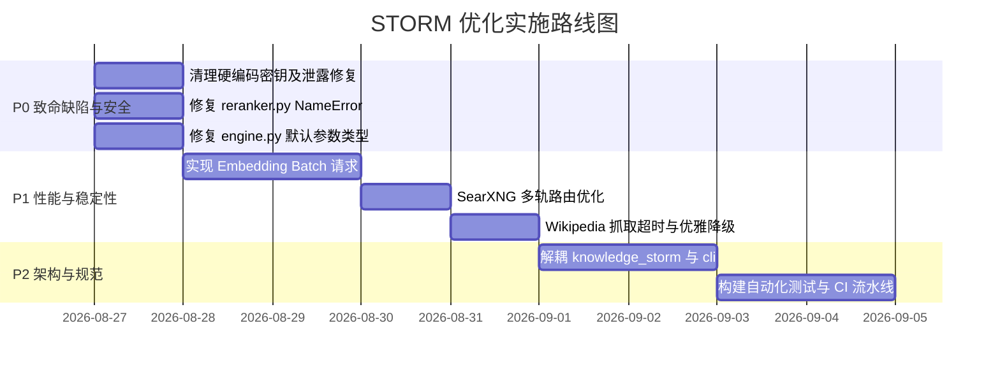

# STORM 架构重构与代码优化改进方案

## 一、优化目标与原则

1. **零密钥泄漏 (Zero Secret Leaks)**：从代码中彻底剥离所有静态凭证，建立环境变量 + 统一配置中心读取机制。
2. **消灭所有致命 Bug (Eliminate Runtime Crashes)**：修复 `NameError`、类型注解混淆、未处理异常等致命代码缺陷。
3. **架构解耦 (Clean Architecture)**：严格遵循单向依赖原则，解除 `knowledge_storm` 对 `cli` 的反向依赖，将配置注入改为依赖注入（Dependency Injection）。
4. **I/O 与并发性能提升 (High Performance I/O)**：支持 Embedding 批量请求接口，重构搜索引擎路由逻辑，增强线程池的中断响应能力与超时容错。

---

## 二、详细重构与代码对比

### 1. 修复 `knowledge_storm/reranker.py` 的 `NameError` 并完善参数

* **问题**：`__init__` 未接收 `api_base`，多处分支引用局部未绑定变量 `api_base`。
* **重构代码方案**：

```python
# knowledge_storm/reranker.py
class Reranker:
    """多后端重排序器。"""

    def __init__(
        self,
        backend: Optional[str] = None,
        api_key: Optional[str] = None,
        api_base: Optional[str] = None,
        model_name: Optional[str] = None,
    ):
        self._backend = "none"
        self._api_key = ""
        self._api_base = ""
        self._local_model = None

        self._backend = backend or "none"
        self._api_key = api_key or ""
        self._api_base = (api_base or "").rstrip("/")
        self._model = model_name or ""

        if self._backend == "cohere":
            if not self._api_key:
                self._api_key = os.environ.get("COHERE_API_KEY", "")
            if not self._api_key:
                raise ValueError("Cohere Rerank requires an API key")
        elif self._backend == "jina":
            if not self._api_key:
                self._api_key = os.environ.get("JINA_API_KEY", "")
            if not self._api_key:
                raise ValueError("Jina Reranker requires an API key")
        elif self._backend == "local":
            model = model_name or "cross-encoder/ms-marco-MiniLM-L-6-v2"
            from sentence_transformers import CrossEncoder
            self._local_model = CrossEncoder(model)
        elif self._backend in ("litellm", "compat", "custom"):
            if not self._api_base:
                raise ValueError(f"{self._backend} rerank requires api_base")
```

---

### 2. 修复 `knowledge_storm/storm_wiki/engine.py` 默认参数错误

* **问题**：`information_table=StormInformationTable` 将类误作为默认值。
* **重构代码方案**：

```diff
-    def run_article_generation_module(
-        self,
-        outline: StormArticle,
-        information_table=StormInformationTable,
-        callback_handler: BaseCallbackHandler = None,
-    ) -> StormArticle:
+    def run_article_generation_module(
+        self,
+        outline: StormArticle,
+        information_table: Optional[StormInformationTable] = None,
+        callback_handler: Optional[BaseCallbackHandler] = None,
+    ) -> StormArticle:
```

---

### 3. 解耦核心包与配置管理器（依赖注入替代反向导入）

* **现状**：
  `knowledge_storm/encoder.py` 和 `knowledge_storm/reranker.py` 内部 `import cli.config_manager`。
* **重构方案**：
  核心模块仅定义纯净的构造函数与接口协议，配置解析与参数组装完全移交至应用层（`cli/`、`frontend/` 或入口脚本）：

```
[UI / CLI / Pipeline Script]
      │ (读取 ~/.storm/config.toml)
      ▼
[组装并实例化 Encoder(api_key=..., api_base=...)]
      │ (依赖注入)
      ▼
[knowledge_storm.engine.STORMWikiRunner]
```

* **实现方式**：
  移除 `encoder.py` 和 `reranker.py` 中的 `try ... import cli.config_manager` 逻辑，若未传入参数则默认使用 `local` 或环境变量，不再跨层侵入。

---

### 4. 优化直连 Embedding 批处理机制 (Batch Embedding)

* **现状**：单条文本循环调用 HTTP 请求。
* **重构代码方案**：

```python
# knowledge_storm/encoder.py
def _encode_direct_batch(self, texts: List[str], batch_size: int = 32) -> np.ndarray:
    """使用 Batch 请求直连 Infinity/兼容 Embedding 端点，大幅缩减 RTT。"""
    import requests
    
    if isinstance(texts, str):
        texts = [texts]
    
    dim = 1024
    all_embeddings = []
    
    for i in range(0, len(texts), batch_size):
        batch = texts[i : i + batch_size]
        # 过滤空字符串，保留索引映射
        valid_inputs = [t if t.strip() else "empty" for t in batch]
        try:
            r = requests.post(
                f"{self._api_base}/embeddings",
                json={"input": valid_inputs, "model": self.embedding_model_name},
                timeout=30,
            )
            if r.status_code == 200:
                data = r.json()
                for item in data.get("data", []):
                    arr = item["embedding"]
                    all_embeddings.append(np.array(arr))
                    dim = len(arr)
            else:
                logger.error(f"Embedding Batch HTTP {r.status_code}: {r.text[:100]}")
                all_embeddings.extend([np.zeros(dim)] * len(batch))
        except Exception as e:
            logger.error(f"Embedding Batch Error: {e}")
            all_embeddings.extend([np.zeros(dim)] * len(batch))
            
    return np.array(all_embeddings)
```

---

### 5. 改进 SearXNG 智能多轨路由策略

* **现状**：`any('\u4e00' <= c <= '\u9fff' for c in query)` 粗暴切到中文组。
* **重构方案**：根据中文字符占比与关键词特征混合路由：

```python
# knowledge_storm/rm.py
def _select_engine_group(self, query: str) -> str:
    chinese_chars = sum(1 for c in query if '\u4e00' <= c <= '\u9fff')
    total_chars = len(query.strip())
    
    # 纯英文或高技术词汇 -> 学术组优先
    if chinese_chars == 0:
        return self.engines_academic or self.engines_general
        
    # 中文字符占比小于 30%（如混合术语 "RAG 架构 benchmark"） -> 通用组/学术组混合
    if chinese_chars / max(total_chars, 1) < 0.3:
        return self.engines_general or self.engines_academic
        
    # 纯中文或主体为中文 -> 中文组（建议默认包含 google, bing 等优质中文检索）
    return self.engines_chinese or self.engines_general
```

---

### 6. 清理管道脚本中的硬编码密钥

* **重构方案**：
  在 `custom_storm_pipeline.py` 和 `continue_pipeline.py` 中，将静态密钥替换为环境变量与配置中心兜底：

```python
# custom_storm_pipeline.py / continue_pipeline.py
DEEPSEEK_API_KEY = os.environ.get("DEEPSEEK_API_KEY")
if not DEEPSEEK_API_KEY:
    try:
        from cli.config_manager import StormConfig
        DEEPSEEK_API_KEY = StormConfig().get("llm.deepseek.api_key")
    except Exception:
        pass

if not DEEPSEEK_API_KEY:
    raise ValueError("Missing DEEPSEEK_API_KEY. Please set environment variable or configure via ~/.storm/config.toml")
```

---

## 三、实施路线图与优先级



---

## 四、验证与验收标准

1. **安全合规测试**：全量代码库执行 `git grep -i "sk-"`，零明文 API Key 检出。
2. **单元测试覆盖**：
   - 实例化 `Reranker(backend="custom", api_base="http://localhost:7998")` 不发生崩溃。
   - `STORMWikiRunner.run_article_generation_module()` 参数传递与类型校验正常。
   - `Encoder` 批量输入（100条文本）请求次数由 100 次降至 $\le 4$ 次。
3. **中断测试**：在长耗时研究阶段执行 `Ctrl+C`，主线程与线程池在 2 秒内干净退出，无悬挂进程。
